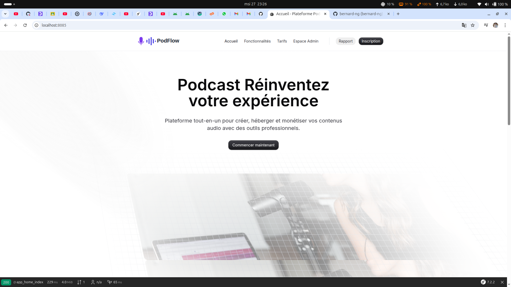
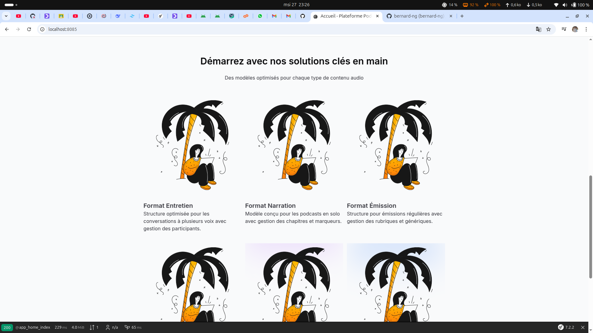

# 🎧 Application de Gestion de Podcasts

## 📌 Description
Cette application web permet de gérer et de partager des podcasts. L'objectif est d'explorer et d'approfondir la maîtrise de **Symfony** en mettant en œuvre des fonctionnalités avancées comme la gestion de fichiers, la pagination et l'intégration d'APIs.

## 🌟 Fonctionnalités principales

- 🎵 **Gestion des podcasts** : Ajouter, modifier et supprimer des podcasts.
- 🔍 **Recherche avancée** : Trouver un podcast par mot-clé, catégorie ou auteur.
- 📂 **Gestion des fichiers audio** : Téléchargement et lecture des podcasts.
- 📑 **Pagination** : Affichage optimisé des listes de podcasts.
- ❤️ **Favoris** : Permet aux utilisateurs de sauvegarder leurs podcasts préférés.
- 🔔 **Notifications email** *(optionnel)* : Informer les abonnés des nouveaux épisodes.
- 🏷️ **Catégories de podcasts** : Organisation des podcasts par thèmes.
- 📢 **Système d’abonnement** : Suivre des créateurs de contenu.

## 📄 Pages principales

- 🏠 **Page d’accueil** : Liste des podcasts récents avec un lecteur audio intégré.
- 📄 **Page des détails du podcast** : Affichage des informations détaillées.
- 🔧 **Page de gestion** *(Créateurs seulement)* : Interface CRUD pour les podcasts.
- 👤 **Page d’inscription et de connexion** : Création de comptes utilisateur.
- 💾 **Page de profil utilisateur** : Liste des podcasts favoris d’un utilisateur.

## 🛠️ Technologies utilisées

- ⚡ **Symfony 7.x**
- 📦 **Doctrine ORM** (Gestion de la base de données)
- 🎨 **Twig** (Moteur de templates)
- 🎭 **JavaScript** *(optionnel)* (Expérience utilisateur améliorée)
- 🔗 **API externe** *(optionnel)* (Analyse audio, envoi d’emails, etc.)

## 🚀 Installation et démarrage

1. **Cloner le dépôt** :
   ```sh
   git clone https://github.com/rooneyi/Poadcast.git
   cd Poadcast

2. **Installer Les Dependances avec Docker** :
   ```sh
   docker-compose up --build
   composer install
   
3. **Installer La Base de donnee** :
   ```sh   
    cp .env.example .env
    php bin/console doctrine:database:create
    php bin/console doctrine:migrations:migrate

4. **Demarrer le serveur avec Docker** :
   
   ```sh
   docker-compose up 

5. **Ouvrir le localhost a l'addresse** :
   ```sh
   http://127.0.0.1:8085
   
## 📌 Contributions
Le[composer.json](composer.json)s contributions sont les bienvenues ! Merci de créer une issue ou une pull request.


## 📸 Captures d'écran
 
